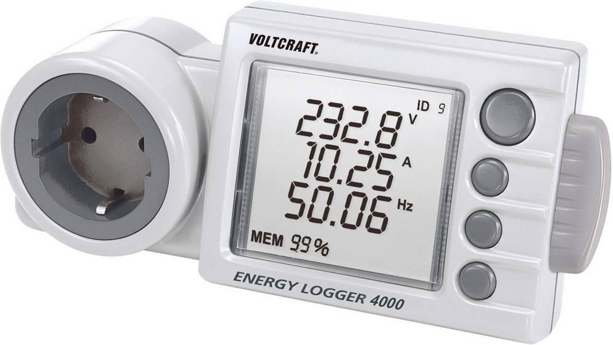
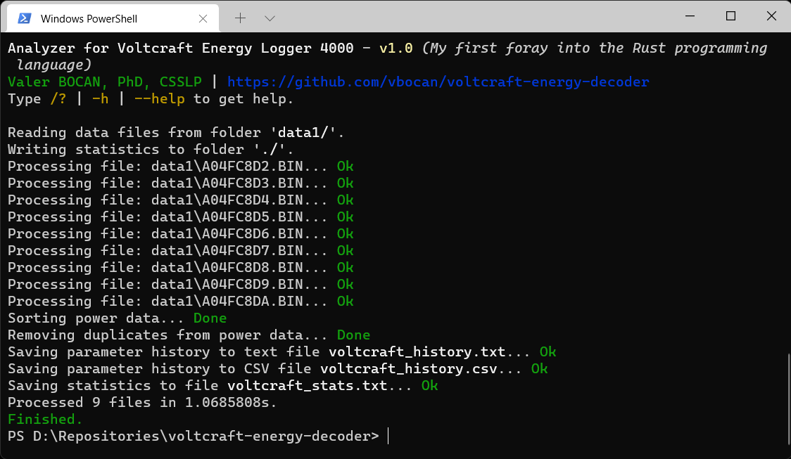

# Analyzer for Voltcraft Energy Logger 4000
##Parser and statistics calculator for files generated by the Voltcraft Energy-Logger 4000 device.

##Voltcraft Energy-Logger 4000

The Energy Logger 4000's built-in memory logs the energy consumption of any connected appliance over a period of 6 months. You can transfer all readings to a PC using any standard SD/SDHC card for further analysis and record keeping, allowing you to detect any hidden power guzzlers, and helping you take appropriate action to save energy. The 3-line display shows electricity consumption, active/apparent power, power factor (cos phi), amperage, voltage and min/max usage. Energy Logger 4000 enables highly accurate readings of appliances operating at loads as little as 1.5 W - perfect to keep an eye on standby power consumption. A built-in backup battery makes sure no readings are lost as a result of power outages.
[Purchase yours from here.](https://www.conrad.com/p/voltcraft-energy-logger-4000-energy-consumption-meter-selectable-energy-tariffs-energy-cost-calculator-125444)

**Features**
- Support for Voltcraft data files containing the minute by minute history of power characteristics.
- History export for voltage, amperage, power factor (cos phi), active power and apparent power, in plain text and CSV.
- Average consumption per day with projected consumption per month and per year.
- Total active energy consumption with peak detection.
- Total apparent energy consumption with peak detection.
- Voltage average with low and high detection.
- Daily power statistics for the entire monitored time span.
- Blackout detection
- Automatic removal of duplicate files (useful for accidental multiple data dumps on the SD card)

**Usage**
You need Rust to build this tool. [Get it here.](https://rustup.rs/)
Once built, invoke it as follows:

`voltcraft_energy_decoder <input folder> <output folder>`
Decode Voltcraft files from a folder and output statistics in different folder.
`voltcraft_energy_decoder <input folder>`
Decode Voltcraft files from a folder and output statistics in the current folder.
`voltcraft_energy_decoder`
Decode Voltcraft files from and place the statistics in the current folder.

Feel free to run the tool on the provided sample data.



**Sample output (statistics)**
```
==== OVERALL STATISTICS ==================
Interval: [2014-07-20 22:04]-[2014-09-12 23:59] (54d:01h:55m)
Average consumption: 1.53kWh/day | Projected: 46.03kWh/month or 559.98kWh/year.

- ACTIVE POWER
Total energy consumption: 82.97kWh.
Peak power was 1.34kW and occured on [2014-08-26 07:52].
Minute by minute average power: 0.06kW.

- APPARENT POWER
Total energy consumption: 93.22kVAh.
Peak power was 1.34kVA and occured on [2014-08-26 07:52].
Minute by minute average power: 0.07kVA.

- VOLTAGE
Minimum voltage was 182.6V and occured on [2014-07-28 08:10].
Maximum voltage was 231.2V and occured on [2014-09-09 04:49].
Minute by minute average voltage: 219.8V.


==== DAILY STATISTICS ====================
[2014-07-20] - 01h:56m recorded activity (8.1%)
      Total active power: 0.14kWh  | Average: 0.07kW  | Maximum: 0.10kW on [2014-07-20 22:28]
    Total apparent power: 0.14kVAh | Average: 0.07kVA | Maximum: 0.10kVA on [2014-07-20 22:28]
    Voltage: Average: 213.1V | Minimum: 207.6V on [2014-07-20 22:12] | Maximum: 217.9V on [2014-07-20 23:59]

[2014-07-21] - 01d:00h:00m recorded activity (100.0%)
      Total active power: 1.71kWh  | Average: 0.07kW  | Maximum: 1.27kW on [2014-07-21 08:02]
    Total apparent power: 1.71kVAh | Average: 0.07kVA | Maximum: 1.27kVA on [2014-07-21 08:02]
    Voltage: Average: 216.7V | Minimum: 200.8V on [2014-07-21 18:30] | Maximum: 224.0V on [2014-07-21 11:02]

[2014-07-22] - 01d:00h:00m recorded activity (100.0%)
      Total active power: 2.09kWh  | Average: 0.09kW  | Maximum: 1.33kW on [2014-07-22 16:07]
    Total apparent power: 2.09kVAh | Average: 0.09kVA | Maximum: 1.33kVA on [2014-07-22 16:07]
    Voltage: Average: 220.3V | Minimum: 211.0V on [2014-07-22 07:39] | Maximum: 228.6V on [2014-07-22 15:21]

[...]
```

**Sample output (blackout history)**
```
==== BLACKOUT HISTORY ====================
104 blackout(s) for a total of 10h:50m.

[2014-07-21 06:11] Duration: 01m
[2014-07-21 09:24] Duration: 01m
[2014-07-21 13:56] Duration: 01m
[2014-07-22 07:08] Duration: 02m
[...]
```

**Sample output (parameter history)**
```
== PARAMETER HISTORY ==

[2014-07-20 22:04] U=211.3V I=0.067A cosPHI=0.83 P=0.012kW S=0.014kVA
[2014-07-20 22:05] U=209.0V I=0.040A cosPHI=0.82 P=0.007kW S=0.008kVA
[2014-07-20 22:06] U=208.7V I=0.040A cosPHI=0.81 P=0.007kW S=0.008kVA
[2014-07-20 22:07] U=209.6V I=0.040A cosPHI=0.78 P=0.007kW S=0.008kVA
[2014-07-20 22:08] U=208.8V I=0.040A cosPHI=0.84 P=0.007kW S=0.008kVA
[2014-07-20 22:09] U=208.1V I=0.040A cosPHI=0.79 P=0.007kW S=0.008kVA
[...]
```

*This is my first foray into the Rust programming language. To the best of my knowledge, the code I've written is idiomatic, but as I delve more into the Rust ecosystem, I am going to refine the code in this repository.*
**Valer Bocan, PhD, CSSLP**